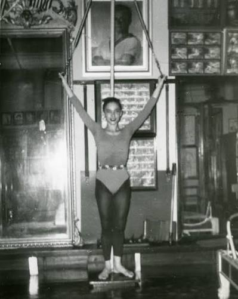

# Eve Gentry: I Dance. I Heal. I Teach.

*Eve Gentry.*

Before she was Eve Gentry, she was a young dancer building a career in New York, moving through the Hanya Holm Company and later founding her own troupe, Eve Gentry Dancers. Persistent back and knee trouble brought her to Joseph Pilates' studio on Eighth Avenue in the late 1930s — one more dancer among many who came to "Uncle Joe" not for fitness, but to keep working.

In 1955, everything changed. Eve was diagnosed with breast cancer and underwent a radical mastectomy — an extreme procedure even by the standards of the time, removing not just breast tissue but most of her pectoral muscle and her lymph nodes. She couldn't lift her arms above her head. Doctors did not expect a dancer's range of motion to return.

She went back to Joseph Pilates. Within a year, she was performing the same advanced apparatus work she'd done before the surgery — work built for a torso that, by every conventional expectation, could no longer do it. The recovery was so complete that when Joe tried to show it to a hospital board as evidence of what movement could do, they didn't believe him. He and Eve filmed her again, without a shirt, so there could be no argument about what the camera was showing.

In 1968, Eve carried that work to Santa Fe, New Mexico, where she opened her own studio and spent the rest of her career teaching people to understand the *why* behind a movement, not just the *how*. She helped found the Institute for the Pilates Method, becoming one of the "elders" — the small first generation who trained directly under Joseph Pilates and carried the method forward after his death in 1967.

Eve Gentry didn't invent the idea that movement is rehabilitation. But she proved it, in her own body, decades before "exercise oncology" was a phrase anyone used. Every era rediscovers what she already knew: that a body doesn't have to be whole in the way it once was to be strong.

*This shirt exists because a Pilates elder used her own recovery to make the case that movement heals — and Therapilatics was built on the same idea.*

---

**Teasers For Tatas**

A real nonprofit born from exactly this intersection — Pilates and breast cancer. Founded in 2016 by a Pilates professional and breast cancer survivor, it funds wellness services (massage therapy, nutrition counseling, support groups) for patients, previvors, thrivers, and survivors, raised through the Pilates community itself.

[Visit Teasers For Tatas](https://teasersfortatas.org)
