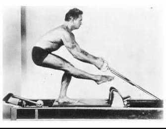
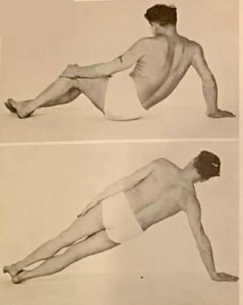

# Joseph Pilates: Strength Comes From the Glass? The Glove? The Core. I Am Joe Pilates.

*Joseph Pilates on the Universal Reformer. Widely circulated instructional photo; exact date unconfirmed.*

He was not supposed to be strong. Born in 1883 near Düsseldorf, Germany, Joseph Pilates was a sickly child — asthma, rickets, rheumatic fever, all three at once, the kind of childhood that gets you bullied rather than admired. The family name didn't help: other children taunted the Pilates kids as descendants of Pontius Pilate. His younger brother Fred later described what that bullying actually looked like — other boys held five-year-old Joseph down and struck him with a stone, blinding him in one eye. "This is when he made up his mind to become strong," Fred recalled. He wasn't exaggerating: once Joseph had rebuilt himself, he turned around and taught Fred the same discipline.

He decided not to stay one. With his father — a gymnast — pushing him, Joseph took up gymnastics, bodybuilding, and boxing. By fourteen he'd rebuilt himself so completely that he was posing for anatomical charts. He kept going: skiing, diving, wrestling, gymnastics. In 1912 he moved to England, where he made a living as a boxer and a circus performer, and — by some accounts — was brought in to teach self-defense to police.

Then came the war. As a German national in England, Joseph was interned for the duration of World War I. He didn't stop moving. He taught exercise to his fellow internees, and when some of them were too sick or injured to get out of bed, he rigged springs to the bed frames so they could still resist against something. That's the exercise apparatus, in its rawest form — the ancestor of the reformer and the Cadillac, invented out of necessity in a prison camp.

He immigrated to New York in 1926 and opened a studio with his wife, Clara, at 939 Eighth Avenue. He called the method Contrology. He never called it Pilates — that name came later, from everyone else.

Here's the part that doesn't fit the poster version of him: Joseph Pilates smoked and drank, openly and constantly, while running a studio built on the idea that the body could be perfected through discipline. He told a reporter in 1964 that he drank a quart of liquor a day, plus beer, and smoked around fifteen cigars. He taught classes in tiny shorts with a cigar in his hand. His own line for it was blunt: "Look at me — smoking and drinking and loving!" He wasn't hiding the contradiction. He was daring you to explain how he was still standing.

He kept teaching into his eighties, well past the point most people slow down, and he died in 1967 at 83.

*Spine twist and side plank, dated 1960 — he would have been about 76.*

> "Patience and persistence are vital qualities" — that's how Joe summed up what it takes to accomplish anything worthwhile, in his 1945 book *Return to Life Through Contrology*.

> I've always suspected Joe was neurodivergent — a mind that invents things nobody asked for, out of bed springs, in a prison camp, because it had no other way to be. I keep Gratz equipment in the studio to honor exactly what he built; everywhere else, I build my own way, same as he did.

*This shirt exists because Joe never asked anyone to live like him — only to move like he taught. Therapilatics teaches the method, not the man.*

**Shop This Shirt** — coming soon (Shopify store not yet live).

*Love the glass bit? [Here's a literal one](https://pilatespeople.store/products/pre-order-pilates-icon-glass) — unrelated shop, not ours.*

---

**The Mythology**

*There's a story that circulates in some corners of the Pilates world — that Joseph Pilates died a hero, running into a fire to save his studio from burning down. It's a good story. It's also not true. A Pilates elder who knew him personally has said plainly that it didn't happen that way: there was a fire in a storage room in 1965, but it didn't touch Joe, Clara, or the studio itself.*

*What actually caught up with him was slower and far less cinematic: decades of heavy cigar smoking left him with advanced emphysema, and by one biographer's account (John Howard Steel's* Caged Lion*), it was pneumonia — taking hold in lungs that were already compromised — that was the immediate cause of death in 1967. He kept teaching and advocating for his method into his eighties, past the point where his own body could still perform everything he'd built it around. That persistence is genuinely admirable. It doesn't erase what the cigars cost him. Cigar smoke does real lung damage even for people who don't inhale it the way a cigarette smoker does — Joe's own lungs made that case before the research caught up. If any of this lands close to home, [smokefree.gov](https://smokefree.gov) is a good place to start.*

---

**Further Reading**

- John Howard Steel, *Caged Lion: Joseph Pilates and His Legacy* (2020)
- Javier Pérez Pont & Esperanza Aparicio Romero, *Joseph Hubertus Pilates: The Biography* (2013)
