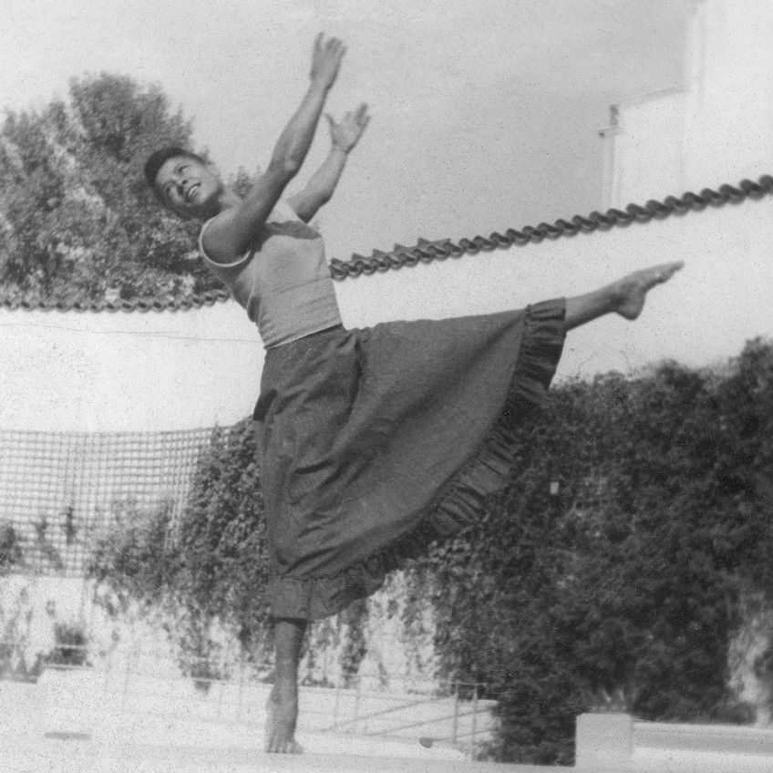

# Kathy Grant: I Dance. I Reclaim. I Lead.

*Kathy Grant — special exercises — Dance Theatre of Harlem. Photo by Marsha Swope. From the Dance Theatre of Harlem records, 1948–1996 (Ford Foundation records), courtesy of the Rockefeller Archive Center.*

Kathleen "Kathy" Stanford Grant grew up in Boston, where she was good enough to earn a scholarship to the Boston Conservatory of Music — and still had to take her ballet classes separately from the white students. That was the shape of a dance career for a Black woman born in 1921: talent was rarely the obstacle.

She moved to New York in the 1940s anyway. Broadway wasn't open to her yet, so she started in Harlem's nightclubs — the Zanzibar Club chief among them — as a chorus girl and dance captain, performing alongside Bill "Bojangles" Robinson and Cab Calloway. She eventually broke through to Broadway in *Finian's Rainbow*, billed as the first racially integrated show of its era, and toured internationally with the Claude Marchant Dance Company — work that took her to places where, for the first time in her life, she said she could walk into a restaurant without wondering if she'd be allowed to sit down.

*A younger Kathy Grant.*

In 1954, a knee injury threatened to end all of it. A fellow performer — accounts differ on whether it was singer Pearl Bailey or dancer Pearl Lang — sent her to Joseph Pilates for rehabilitation. It worked, and Kathy stayed. She trained first under Carola Trier, then directly with Joseph and Clara Pilates, and became one of only two people Joseph Pilates ever personally certified to teach his method. The other was a young Puerto Rican dancer named Lolita San Miguel.

At a time when Black dancers were routinely shut out of American ballet, Joseph Pilates simply taught her — seriously enough that she earned one of the rarest credentials in the method's history.

In 1970, Kathy became the first administrative director of the newly formed Dance Theatre of Harlem, where mornings began with her own blend of Pilates mat work and jazz before the dancers moved into ballet technique. She went on to run a Pilates studio inside Henri Bendel's department store, serving working dancers and the store's wealthy clientele side by side, and became the first African American appointed to the National Endowment for the Arts panel. In 1988 she brought her teaching to NYU's Tisch School of the Arts, where she developed "Before the Hundred" — her own vocabulary for preparing a body, any body, to do the work safely.

Kathy Grant spent five decades adapting the method to bodies Joseph Pilates never trained for: dancers recovering from injury, students who'd never danced at all, a world that hadn't caught up to her yet. She kept teaching until she'd made room for the rest of them.

> I'm a Black woman too, and I recognize the shape of what she built when the obvious doors didn't open — a path made by insistence, one certification and one job at a time.

*This shirt exists because one of only two people Joseph Pilates ever certified had to build her own path to get there — and Therapilatics believes the work should be open to whoever needs it.*

---

Kathy's own archive — memories, artifacts, and exercises shared by her students — lives at [kathygrantpilates.com](https://www.kathygrantpilates.com).
